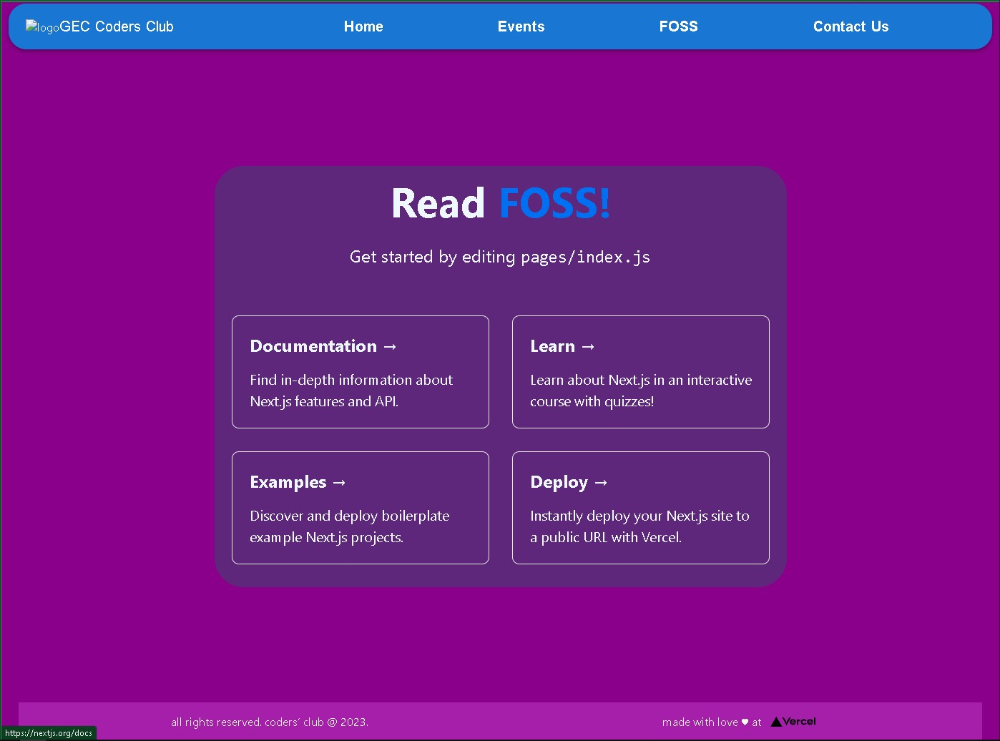

# GEC Coders Club Website

Welcome to the GEC Coders Club website project! This website serves as the online platform for our coding community, providing information about our events, resources, and opportunities for aspiring developers and coding enthusiasts.

## Table of Contents

- [GEC Coders Club Website](#gec-coders-club-website)
  - [Table of Contents](#table-of-contents)
  - [Introduction](#introduction)
  - [Current Plan](#current-plan)
  - [Setting Up](#setting-up)
  - [Contributing](#contributing)
    - [How to Contribute](#how-to-contribute)

## Introduction

This project is build using basic [Next.js](https://nextjs.org/) architecture. The plan and prototype for the project is described on the excalidraw Live collaboration Sketch. Feel free to give you suggestion in the excalidraw plan. If you cant able to open the online collaboration link of Excalidraw plan, you can use Excalidraw extension in vscode to open and edit the plan.

## Current Plan

<h3>Two branch Approach</h3>

The `main` branch of our project contains the code which is being developed using JavaScript. We also have another separate branch for our project called `next-ts` that uses TypeScript as its main coding language, along with the Next.js framework. These two branches are being developed independently, but both have the same ultimate goal: to create the final website according to the planned design and user interface.

<h3>Wireframe</h3>

Our project's blueprint and structural planning are currently in progress through live collaboration on Excalidraw. Excalidraw provides a dynamic environment for team members to collectively sketch out the website's layout, sections, and content flow. This collaborative process ensures that everyone's input is considered, resulting in a well-organized and comprehensive structure.

✏ Wireframe and planning : [Excalidraw wireframe](https://excalidraw.com/#room=18699433c225176ff560,yPnaQIh4pP0gF8QMUxQQEg)

🖌️ Design Link: [Figma](https://www.figma.com/file/NgAJI0njrDA1ZKtPykmqPZ/Coders'-Club%3A-Website?type=design&node-id=7%3A2&mode=design&t=EoajAN7gDnKzAiBh-1)

In future for UI desings suggestions and UI planing we can move to more efficient and feature reach tools to have proper and detailed plan and to have seamingless collaboration and exchange of ideas. Any suggestions for the same will be highly appreciated.

<h3>Present State</h3>



## Setting Up
Make sure you have [node js](https://nodejs.org/en/download) and [npm](https://docs.npmjs.com/downloading-and-installing-node-js-and-npm) installed 

You can use [bun](https://bun.sh/docs/installation) (only for Linux and MacOS users) too I've set the enviroment up for it too

Install typescript

cloning and installing this repo should install typescript locally but if you wish to install it globally run

```bash
npm install -g typescript 
```


Clone this repo and switch to this branch (next-ts)

Clone:
```bash
git clone https://github.com/Engicos-Coders-Club/club-official-website.git
```

then switch branch 

Switch to next-ts:
```bash
git checkout next-ts
```

once switched, install the necessary packages by using this command

Install commands:
```bash
npm install 
```
or 
```bash
npm i
```

Then run the development server:

```bash
npm run dev
# or
yarn dev
# or
pnpm dev
```

Open [http://localhost:3000](http://localhost:3000) with your browser to see the result.

You can start editing the page by modifying `app/page.tsx`. The page auto-updates as you edit the file.

This project uses [`next/font`](https://nextjs.org/docs/basic-features/font-optimization) to automatically optimize and load Inter, a custom Google Font.

To convert tsx to jsx use:
```bash
npm run transpile
```
## Theming

This project supports both light as well as dark theme. You should configure the components in the following sense to support both the themes:

```css
.component{
    color:black; // always specify the light theme styles
}

html.dark component{
    color:white; //dark theme styles
}
```
As we can see above, we declare the light theme styling by directly targeting the elements using selectors and we declare the dark theme styling by targeting the element through html.dark

## Contributing

Feel free to give suggestions on any thing you like, you feel should be changed. Even with HTML and CSS knowledge you can start contributing in this project.

### How to Contribute

1. Fork this repository and `git clone` it to your local machine.
2. Create a new branch for your feature or bug fix: 
```
git checkout -b my-feature
```

3. Commit your changes: 
```
git commit -m 'Add new feature'
```
4. Push to the branch: 
```
git push origin my-feature
```
5. Submit a **[Pull Request](https://github.com/Engicos-Coders-Club/club-official-website/pulls)**.

We understand that collaboration and design are iterative processes. As we progress, we'll continuously seek your feedback and input to refine the blueprint, structure, and UI design. Our goal is to create a website that aligns with your vision and effectively communicates your message to your audience.